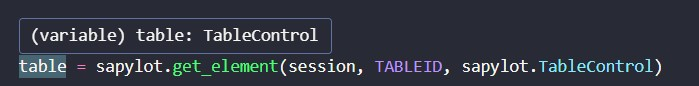

# Um olhar aprofundado

O objetivo desta seção é lhe apresentar um olhar mais aprofudado sobre o funcionamento da biblioteca.

---

## Como o SAPylot funciona

Agora que você já possui o conhecimento sobre como funcionam as automações do SAP GUI, vamos entender um pouco sobre como o SAPylot funciona e como ele pode tornar seu desenvolvimento mais produtivo

Dentro do SAP GUI, todo componente de interface possui um tipo. O SAPylot busca traduzir estes tipos para dentro do python utilizando o paradigma de classes. Com isso visamos ajudar o desenvolvedor fornecendo *auto complete*, *type hinting* e melhor tratamento de erros a partir de exceções personalizadas


## Sistema de tipos
Caso voce já tenha tentado criar automações diretamente com ``pywin32`` voce já pode ter percebido que em um longo prazo, ou se tratando de um código muito grande, a base de código pode se tornar de dificil manutenção. Os elementos representados como objetos COM, como nossa ``session`` vista anteriormente, não são reconhecidos pelo Python e, consequentemente não existe um *auto-complete* que facilite para que o desenvolvedor possa saber exatamente o que fazer com cada item.

### Classe ``Element``

A classe ``Element`` é a base da nossa biblioteca e também a base do sistema de tipos. Ela representa os elementos **GuiComponent Object** e **GuiVComponent Object** do SAP GUI. Por ser a base, ela é compatível com todos os elementos de interface e é utilizada como tipo padrão retornado pela função ``get_element()``

Todas as demais classes da biblioteca herdam de ``Element``.

### Como o sistema de tipos funciona

Cada elemento (ou pelo menos a grande parte deles) possui uma representação fornecida por nossa biblioteca em forma de classe.
Ao buscar um elemento com a função ``get_element()`` voce pode informar uma destas classes no ultimo parametro conforme o exemplo abaixo:

```{.py3}
el = sapylot.get_element(session, TABLEID, sapylot.TableControl)
```
O que será feito de fato, é:

- A função irá tentar instanciar um objeto interno utilizando o ID que foi passado
- Devido a todas as classes herdarem de ``Element``, durante a instanciação o método  ``_find()`` será chamado.
- O método irá buscar o elemento, e configurar todos os atributos principais.
- Durante a instanciação da classe, também irá ocorrer a checagem de tipos.
- O retorno do método será um elemento da classe informada.

/// details | Aviso
    type: warning

Todos os tipos são compatíveis com ``Element`` porém os tipos não são necessáriamente compatíveis entre si. 
Exemplo: Tentar chamar ``get_element(session, TABLEID, sapylot.TableControl)`` para uma tabela do tipo *GuiShell* irá ocasionar em um erro em tempo de execução.
///



## Atributo ``rawElement``

Durante o momento de instanciação de cada classe, o atrbuto ``rawElement`` é definido. Este atributo representa o elemento selecionado diretamente em formato de objeto COM.

Quando usar?

- ``rawElement`` é usado internamente pela biblioteca para manipular o SAP. Deve ser utilizado diretamente pelo usuário quando este desejar alguma função não fornecida pela biblioteca. Exemplo:


/// details | Aviso
    type: warning

Como ``rawElement`` represesnta diretamente o objeto COM, ele é identificado como any e não possui nenhum mapeamento de funções disponíveis ou tratamento de exceções. Use com cuidado.
///