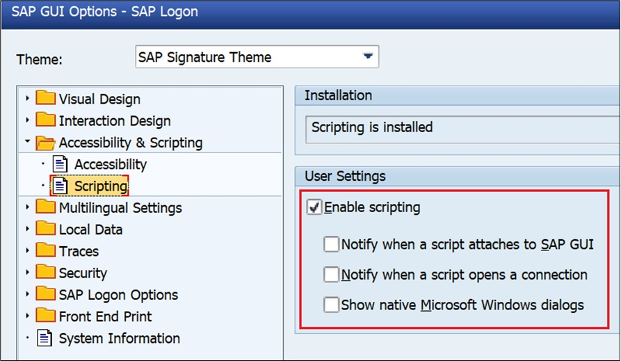

## Pré requisitos

---

O principal pré requisito para uso da biblioteca é possuir o **SAP Scripting** instalado e habiitado no SAP GUI. Também lembre-se de desativar todos os poups de aviso. Isso evitará que o script quebre em tempo de execução por não encontrar um elemento.



Além disso é desejável que você possua um conhecimento básico da ferramenta de automação SAP. Caso deseje, você pode verificar nossa [introdução a automações do SAP GUI](../sap-scripting/introduction.md).

## Instalação do pacote

Primeiramente, começamos pelo inicio: A instalação do pacote!

```{.bash }
pip install sapylot
```

Importe o SAPylot dentro do arquivo onde você deseja desenvolver seu script

```{.py3 }
import sapylot
```

Ou

```{.py3 }
from sapylot import get_element, start_transaction
```

Com a biblioteca devidamente instalada e importada, podemos começar a escrever algumas automações
