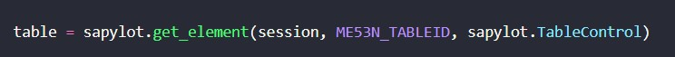
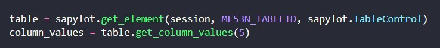
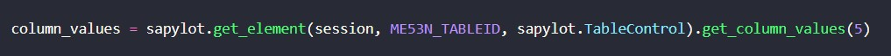

# Boas práticas e dicas de uso

---

## Trabalhando com IDs

Durante a criação de um script, nosso maior inimigo para manter um código limpo e compreensivel definitivamente são os IDs de cada elemento.

IDs podem variar de tamanho e ir desde algumas letras para linhas completas! Para lidar com este incoveniente, recomendamos o uso de constantes.

Voce pode criar um arquivo nomeado como ``consts.py`` e salvar todos os IDs que voce está usando no projeto ou apenas os mais longos. Após salvar, basta importar no script e referenciar na chamada da função ``get_element()``

```{.py3 title="consts.py"}
ME53N_TABLEID = r"wnd[0]/usr/subSUB0:SAPLMEGUI:0015/subSUB2:SAPLMEVIEWS:1100/subSUB2:SAPLMEVIEWS:1200/subSUB1:SAPLMEGUI:1211/tblSAPLMEGUITC_1211"
```



/// details | Dica
    type: tip

Armazene seus IDs como `raw strings` e utilize nomes de fácil identificação
///

## Encadeamento de métodos

A estrutura da biblioteca suporta o encadeamento de métodos, use sempre que possível!

Exemplo: Coletar os valores da coluna de uma tabela

- Sem encadeamento de método



- Utilizando encadeamento de método



- OBS: O exemplo leva em conta que apenas os dados da coluna são relevantes