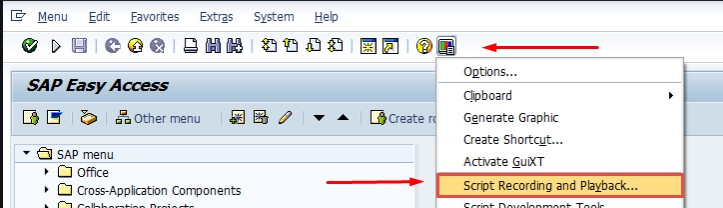
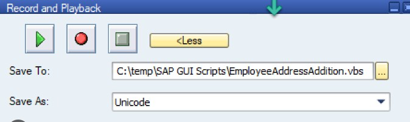

# Ferramenta de gravação de scripts SAP

---

O SAP nos fornece uma ferramenta interna para criação de scripts que funciona gravando os passos executados pelo usuário em uma sessão e gravando estes passos em um arquivo de extenção .VBS.

## Como utilizar

- Primeiramente, você deve ter a execução de scripts habilitada e o SAP Scripting instalado.
- Com o SAP aberto, vá até a barra de titulo e clique na ultima opção
- Clique em "Script and playback"

- Após selecionar a opção, uma nova aba irá aparecer com os controles para a gravação e reprodução de scripts.
- Nesta tela você pode selecionar onde irá ficar salvo o seu script e iniciar ou interromper a gravação


## Resultado

- Após iniciar uma gravação, executar o que desejar e parar a gravação, o SAP irá gerar em um arquivo .VBS. Abaixo, um exemplo de arquivo que gravou os passos de se realizar um login.

```{.vbscript}
If Not IsObject(application) Then
   Set SapGuiAuto  = GetObject("SAPGUI")
   Set application = SapGuiAuto.GetScriptingEngine
End If
If Not IsObject(connection) Then
   Set connection = application.Children(0)
End If
If Not IsObject(session) Then
   Set session    = connection.Children(0)
End If
If IsObject(WScript) Then
   WScript.ConnectObject session,     "on"
   WScript.ConnectObject application, "on"
End If
session.findById("wnd[0]").maximize
session.findById("wnd[0]/usr/txtRSYST-BNAME").text = "username"
session.findById("wnd[0]/usr/pwdRSYST-BCODE").text = "********"
session.findById("wnd[0]/usr/pwdRSYST-BCODE").setFocus
session.findById("wnd[0]/usr/pwdRSYST-BCODE").caretPosition = 12
session.findById("wnd[0]").sendVKey 0
```
